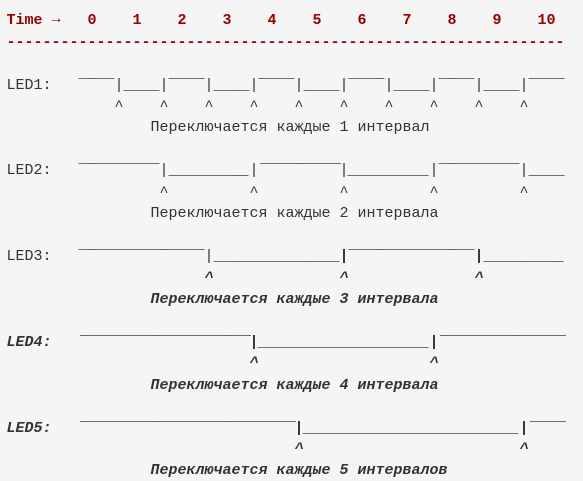

# Управление пятью светодиодами с разными периодами мигания с использованием прерываний таймера

## 1. Введение

Данный документ описывает решение задачи по управлению пятью светодиодами, подключёнными к одному порту микроконтроллера (PORTB0–PORTB4), таким образом, чтобы каждый светодиод мигал с заданным индивидуальным периодом. В основе решения лежит использование периодических прерываний по переполнению таймера/счётчика Timer1 микроконтроллера AVR, что позволяет избежать использования блокирующих функций задержки (например, `delay()`) и обеспечивает точное по времени управление.

## 2. Постановка задачи

Необходимо разработать прошивку для микроконтроллера, которая:
*   Управляет пятью светодиодами, подключёнными к пинам PORTB0-PORTB4.
*   Каждый светодиод должен мигать с уникальным периодом, заданным как целое число минимальных временных интервалов.
*   Запрещено использовать функции `delay()`, `millis()`, `pinMode()`, `digitalRead()`, `digitalWrite()`. Настройка пинов и управление их состоянием должно осуществляться через прямую работу с регистрами `DDRx`, `PINx`, `PORTx`.
*   Разрешено использовать только один таймер для всех светодиодов.
*   Необходимо применять побитовые операторы (|, &, >> и т. д.) для изменения состояния регистров;
*   Прерывания таймера должны происходить точно по времени, с разрешением 1/16000000 секунды, без приблизительных задержек.

Представленная временная диаграмма иллюстрирует требуемое поведение:



## 3. Предложенное решение

Решение основано на использовании 16-битного таймера/счётчика Timer1 в режиме нормального счёта (Normal Mode) с прерыванием по переполнению.

### 3.1. Настройка портов ввода/вывода

Пины PORTB0-PORTB4 настраиваются как выходы с помощью регистра `DDRB`. Изначально все светодиоды выключены (`PORTB = 0`).

```c
DDRB |= (1 << 0) | (1 << 1) | (1 << 2) | (1 << 3) | (1 << 4);
PORTB = 0;
```

### 3.2. Обработчик прерывания (ISR)

Функция `ISR(TIMER1_OVF_vect)` вызывается каждый раз при переполнении Timer1.

```c
volatile unsigned int count = 0;
volatile uint8_t portb_state = 0;  

ISR(TIMER1_OVF_vect) {
  count++; // Инкрементируем глобальный счётчик

  // Проверка и переключение каждого светодиода
  if (count % PERIOD_LED1 == 0) portb_state ^= (1 << 0);
  if (count % PERIOD_LED2 == 0) portb_state ^= (1 << 1);
  if (count % PERIOD_LED3 == 0) portb_state ^= (1 << 2);
  if (count % PERIOD_LED4 == 0) portb_state ^= (1 << 3);
  if (count % PERIOD_LED5 == 0) portb_state ^= (1 << 4);
  
  PORTB = portb_state; // Запись нового состояния порта

  if (count >= 60) count = 0; // Сброс счётчика для предотвращения переполнения
}
```

### 3.3. Функция `setup()`

```c
void setup() {
  cli(); // Отключить глобальные прерывания
  
  TCCR1A = 0; // Обнулить TCCR1A
  TCCR1B = 0; // Обнулить TCCR1B
  TCCR1B |= (1 << CS12); // Установить предделитель 256 для Timer1 (CS12=1)
  TIMSK1 |= (1 << TOIE1); // Разрешить прерывание по переполнению Timer1
  
  // Настройка PORTB0-PORTB4 как выходов
  DDRB |= (1 << 0) | (1 << 1) | (1 << 2) | (1 << 3) | (1 << 4);
  PORTB = 0; // Изначально все светодиоды выключены
  
  sei(); // Включить глобальные прерывания
}
```

### 3.4. Функция `loop()`

```c
void loop() {
  // Пустой цикл. Вся логика реализована в обработчике прерывания.
}
```
`

Исходный код можно посмотреть по ссылке https://github.com/yuvwwa/IoT/blob/main/LedCascade/LedCascade.ino


## 4. Результаты и логика работы

Данное решение полностью удовлетворяет всем требованиям задачи:

*   **Управление пятью светодиодами:** Реализовано через биты PORTB0-PORTB4.
*   **Разные периоды мигания:** Константы `PERIOD_LEDx` задают индивидуальные периоды, выраженные в "тиках" таймера.
*   **Использование одного таймера:** Timer1 управляет логикой для всех пяти светодиодов.
*   **Без `delay()` и `millis()`:** Все задержки и синхронизация реализуются через прерывания.
*   **Прямая работа с регистрами:** `DDRB`, `PORTB`, `TCCR1A`, `TCCR1B`, `TIMSK1` используются напрямую.
*   **Побитовые операции:** Активно используются `|`, `&`, `^=`, `<<`.
*   **Точные прерывания:** Таймер настроен на точное, регулярное генерирование прерываний.

Каждый "тик" (переполнение Timer1) происходит с периодом, определённым предделителем. Внутри ISR счётчик `count` увеличивается. Затем для каждого светодиода проверяется, является ли `count` кратным его заданному периоду. Например:

*   LED1 (PERIOD_LED1 = 1) будет переключаться при каждом тике (`count % 1 == 0` всегда истинно).
*   LED2 (PERIOD_LED2 = 2) будет переключаться при каждом втором тике (`count = 2, 4, 6...`).
*   LED3 (PERIOD_LED3 = 3) будет переключаться при каждом третьем тике (`count = 3, 6, 9...`).
*   И так далее.

Сброс `count` до 0, когда он достигает 60 (наименьшее общее кратное 1, 2, 3, 4, 5), гарантирует, что паттерн мигания для всех светодиодов будет синхронизирован и корректно повторяться. Например, на 60-м тике все светодиоды вернутся в то же состояние, в котором они были на 0-м тике (при условии, что `portb_state` был инициализирован как 0).


## 5. Визуализация работы

Видео-демонстрацию на реальном микроконтроллере можно посмотреть по ссылке https://disk.yandex.ru/i/8NYXMh7QhVxFBA

Ссылка на wokwi с работающей симуляцией всей схемы и кода https://wokwi.com/projects/443849899743408129


## 6. Вывод

Предложенное решение является эффективным способом управления множеством независимых мигающих светодиодов с использованием одного таймера и прерываний. Оно строго соответствует всем поставленным требованиям, демонстрируя глубокое понимание работы с регистрами микроконтроллера и организации асинхронных процессов.
